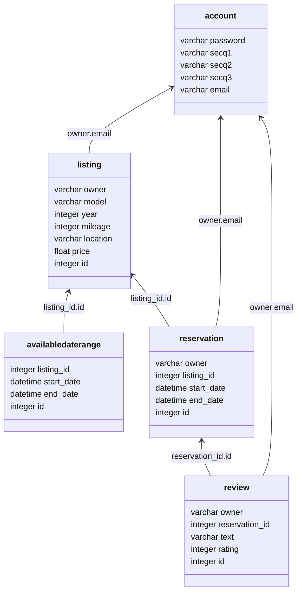

# Database Schema

```mermaid
classDiagram
    direction BT
    class account {
        varchar password
        varchar secq1
        varchar secq2
        varchar secq3
        varchar email
    }
    class availabledaterange {
        integer listing_id
        datetime start_date
        datetime end_date
        integer id
    }
    class listing {
        varchar owner
        varchar model
        integer year
        integer mileage
        varchar location
        float price
        integer id
    }
    class reservation {
        varchar owner
        integer listing_id
        datetime start_date
        datetime end_date
        integer id
    }
    class review {
        varchar owner
        integer reservation_id
        varchar text
        integer rating
        integer id
    }

    availabledaterange --> listing: listing_id.id
    listing --> account: owner.email
    reservation --> account: owner.email
    reservation --> listing: listing_id.id
    review --> account: owner.email
    review --> reservation: reservation_id.id

```