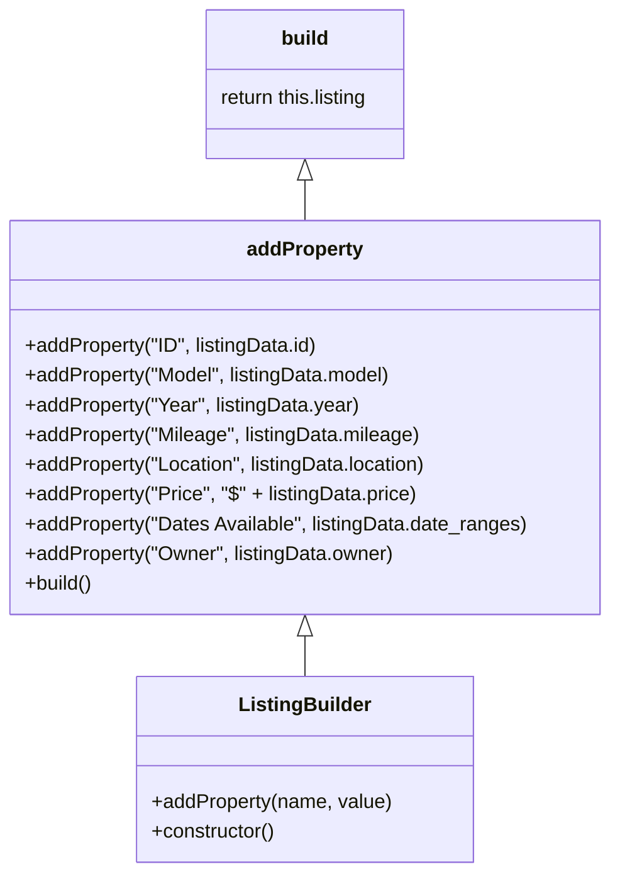
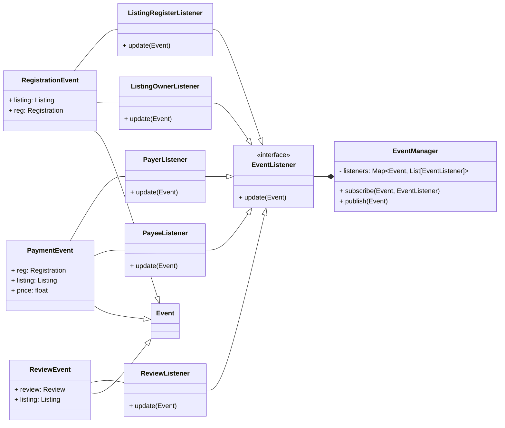
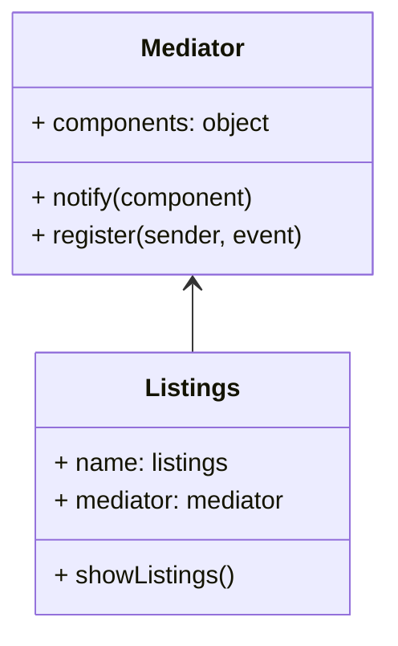
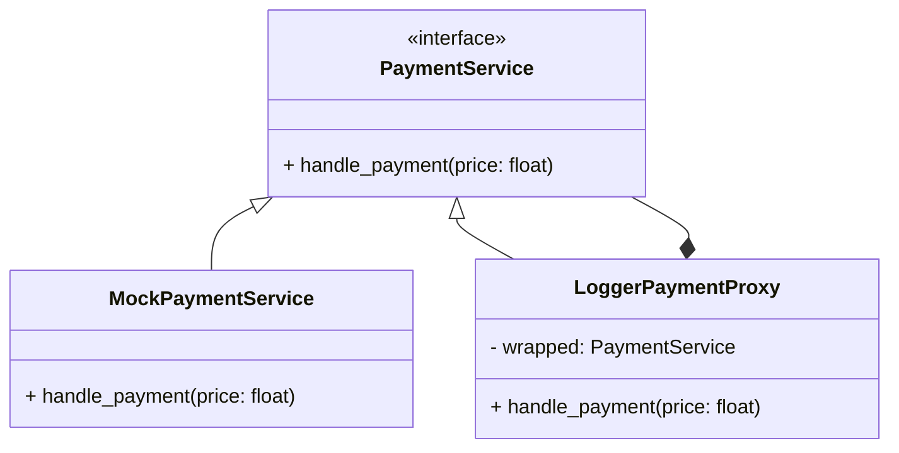
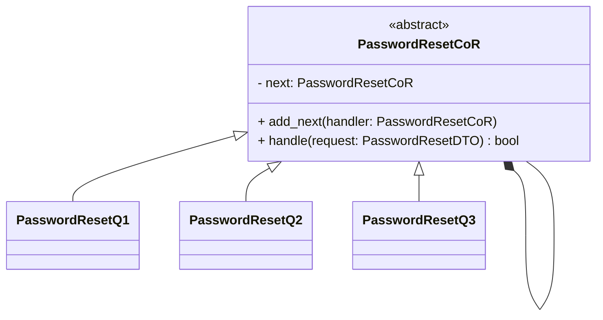
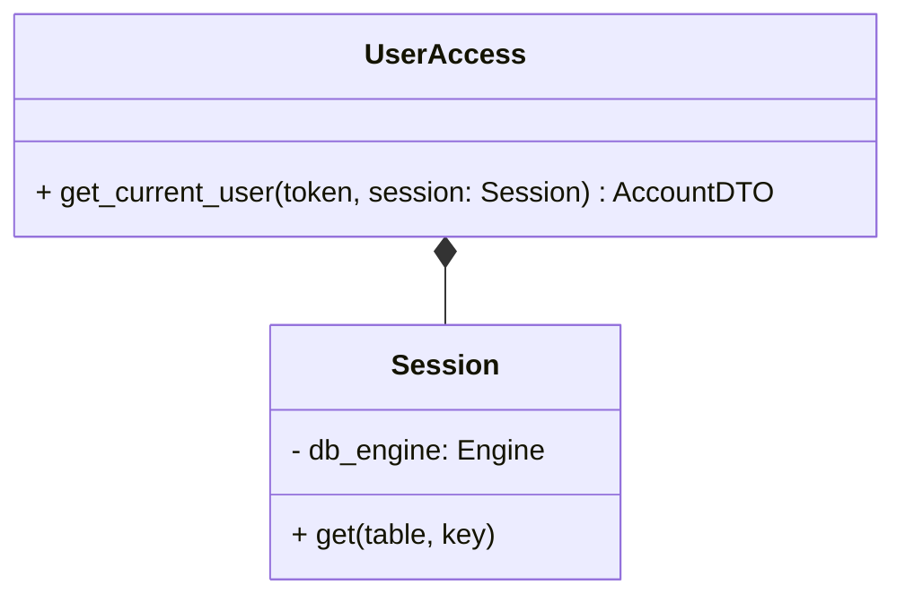

## Builder

file: searchlistings.html

We implement the builder pattern in a relatively simple way in order to dynamically build different listing objects.

We can create as many ListingBuilder class objects as we need, and dyamically add values of the listing by name and value, and once finished, can have it build and return the complete object for each listing.

## Event Observer

file: events.py

We create an event system that allows for subscribing to events created in the backend. This is designed to be used for
notifying users, however it could be used for other functionality if required.

The pattern works by reflecting into the event type passed, and firing registered listeners
for that type via a map. This allows for more granular activations than the raw observer pattern.

Currently, these just print an email to the console, but a quick addition of a proper email server would allow actual
email responses.

## Mediator

file: mylistings.html

The Mediator pattern is implemented to mediate communication between listings and the page.

We create a Mediator and Listings instance, and register it with the Mediator. Next we call showListings which will notify Mediator. Mediator will handle the message to display the listings, that now appear on page.

After it displays all of the listings, the buttons on each listing handle their own functions related to their listing. The Edit Listing button also calls showListings to refresh the listing information after making changes.

## Payment Proxy

file: payment.py

The payment system is implemented as a mock with a proxy for logging. The mock takes the place
of an actual payment handler, and simply does nothing. The logger proxy wraps this mock (or a real
service), and simply logs the action in the server before performing the wrapped services transaction.

## Password Reset CoR

file: reset.py

The password Chain of Responsibility works as one would think, returning
false early if any question fails, or true otherwise.

## User access singleton

file: deps.py

Since we wanted to keep proper login functionality, our singleton could not be implemented all as one class due
to python limits on callbacks for fastapi, but the pattern is still there. Roughly:

Here get_current_user will take an OAuth token and a database session, and either return an account
record if the token is valid, or raise an exception otherwise. This is used in the fastapi dependency injection system
where ever we need access to the current user, ensuring there is only a single way to get the current user,
and that whenever one has a user account, it is known to be verified.

To use this dependency injection we cannot use the UserAccess namespacing, but that's ultimately just syntax,
and the underlying singleton pattern is still here.
