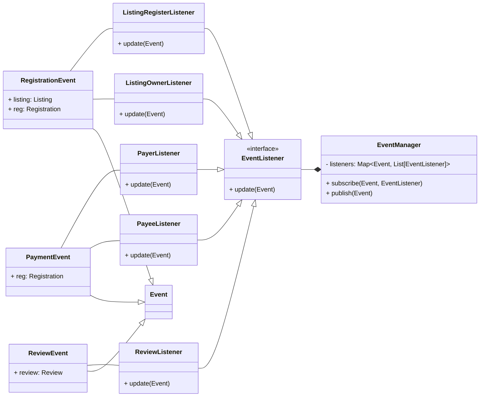

## Event Observer

We create an event system that allows for subscribing to events created in the backend. This is designed to be used for
notifying users, however it could be used for other functionality if required. 